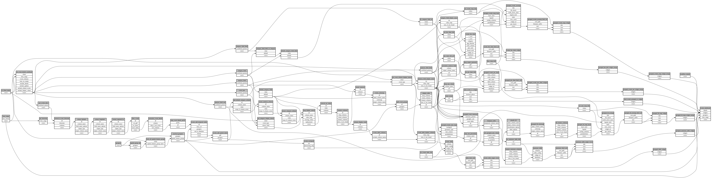

```
# AUTOGENERATED BY ECOSCOPE-WORKFLOWS; see fingerprint in README.md for details

```

```yaml
# fingerprint:
artifacts_sha256_basic: d84302b28a58cfe94bf7c4a188a7dbac3d8113ff674142511e16c748519c74bc
artifacts_sha256_strict: 94807fbb413d7dfad661ab89cb04b250ab31513317e981b5471b3881e3225ec1
installed_requirements:
- channel: https://repo.prefix.dev/ecoscope-workflows/
  name: ecoscope-workflows-core
  version: {version: ==0.22.15}
- channel: https://repo.prefix.dev/ecoscope-workflows/
  name: ecoscope-workflows-ext-ecoscope
  version: {version: ==0.22.15}
params_sha256: 11fdf84f6cc38bde715b5d743374ecfca74546b0eb262244339d0525a4f4ec04
spec_sha256: 08821150ee4720eb63a0a9eadfe6928b4ae40049b8f87db76385360c2a0c77f2

```

# ecoscope-workflows-event-details-workflow


